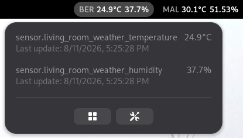
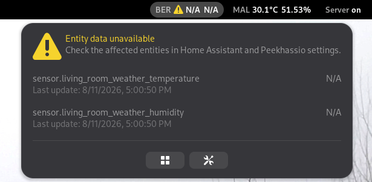
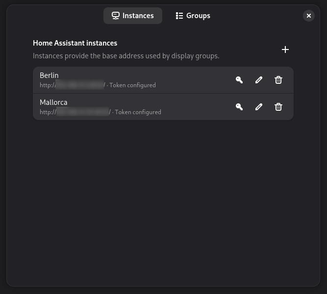
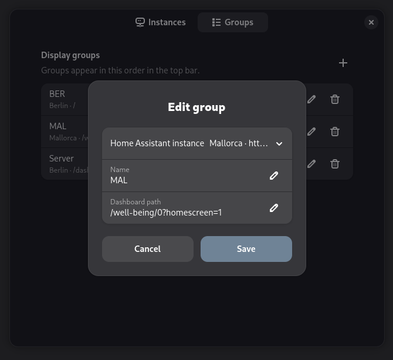
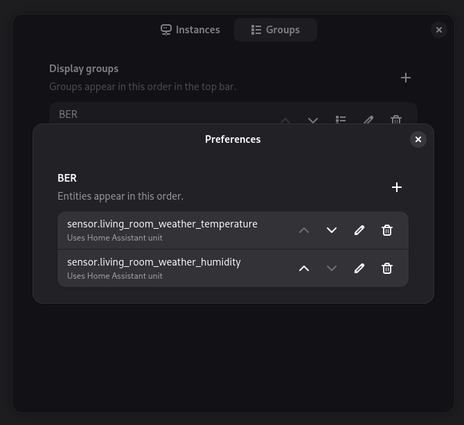

# Peekhassio

Peekhassio is a GNOME Shell extension that displays selected Home Assistant
entity states directly in the GNOME top bar. It lets you peek at useful values
without opening the Home Assistant dashboard.

The name combines “peek” with “Hassio,” while sounding like “Picasso.”

Peekhassio 1.0.4 is feature-complete. It targets and has been manually tested
with GNOME Shell 50 only.

This GitHub repository is a public mirror of Peekhassio's source code. Report
bugs and feature requests by leaving a comment on Peekhassio's page on
[GNOME Shell Extensions](https://extensions.gnome.org/).

## Functionality

Create ordered top-bar groups containing the Home Assistant entities you want
to monitor. Each group shows its name followed by the current entity values and
units:

```text
[Bathroom 27°C 50%] [Living room 25°C 45%]
```



Peekhassio supports:

- Multiple Home Assistant instances using long-lived access tokens.
- User-defined, ordered groups and entities.
- Optional per-entity unit overrides, with Home Assistant's reported unit used
  by default.
- Initial values and live updates through Home Assistant's authenticated
  [WebSocket API](https://developers.home-assistant.io/docs/api/websocket/).
- Automatic reconnection, stale-value presentation, and isolation between
  instances.
- Immediate updates after configuration or credential changes.
- Group menus with full entity IDs, current or last-known values, and the time
  each value was received.
- Shortcuts to a group's Home Assistant dashboard and Peekhassio settings.
- Compact warning indicators with details when an instance or entity has a
  problem.



See [RELEASE_NOTES.md](RELEASE_NOTES.md) for release contents, compatibility,
known limitations, and upgrade behavior.

## How to install

### Requirements

- GNOME Shell 50
- A reachable Home Assistant instance
- A Home Assistant long-lived access token
- GNOME Secret Service, normally provided by GNOME Keyring

### Install from source

Building from source additionally requires Node.js 24, npm 11, `unzip`, and
the `gnome-extensions` command supplied by GNOME Shell tooling.

Clone the repository, then install the locked dependencies and the extension:

```sh
npm ci
npm run check
npm run install:extension
gnome-extensions enable peekhassio@de-gouveia.eu
```

Open the preferences with the Extensions application or:

```sh
gnome-extensions prefs peekhassio@de-gouveia.eu
```

The install command creates a clean extension archive before installing it for
the current user. A Shell session restart may be necessary when installing the
extension for the first time.

## How to configure

1. Add a Home Assistant instance with a name, base URL, and long-lived access
   token.
2. Add a display group and assign it to an instance.
3. Select **Manage entities** on the group and add entity IDs in
   `domain.object_id` form.
4. Optionally override an entity's unit and reorder groups or entities.

Changes are saved immediately. Non-secret configuration is stored in GSettings;
access tokens are stored separately in GNOME Secret Service and never in the
configuration JSON.

Use an HTTPS base URL whenever possible. Plain HTTP can be enabled explicitly
for local-network setups, but it does not protect credentials or Home Assistant
data in transit.

### Instances

Add each Home Assistant server and its credentials on the **Instances** page.
Every instance needs its own access token.



### Groups and entities

Groups control which sets of values appear in the top bar and their display
order.



Within a group, add and order entity IDs and optionally override their units.



## Uninstall

Delete configured instances in preferences first if their stored tokens should
also be removed. Then disable and uninstall the extension:

```sh
gnome-extensions disable peekhassio@de-gouveia.eu
gnome-extensions uninstall peekhassio@de-gouveia.eu
```

Uninstalling the extension alone does not promise removal of GSettings data or
Secret Service items.

Developer documentation, including build, test, Shell integration, and
debugging instructions, is available in
[docs/DEVELOPMENT.md](docs/DEVELOPMENT.md).

Peekhassio is licensed under [GPL-3.0-or-later](LICENSE).
